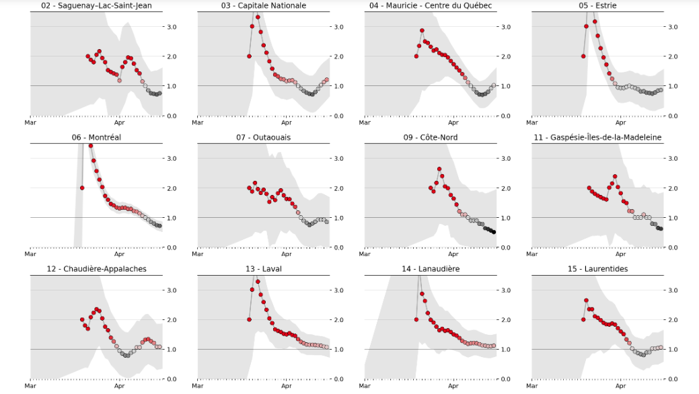

[RealtimeR0-QC.ipynb](RealtimeR0-QC.ipynb) | Adaptation du [travail](https://github.com/k-sys/covid-19/blob/master/Realtime%20R0.ipynb) de [Kevin Systrom](http://systrom.com/blog/the-metric-we-need-to-manage-covid-19/) pour les données du Québec.
--- | ---

